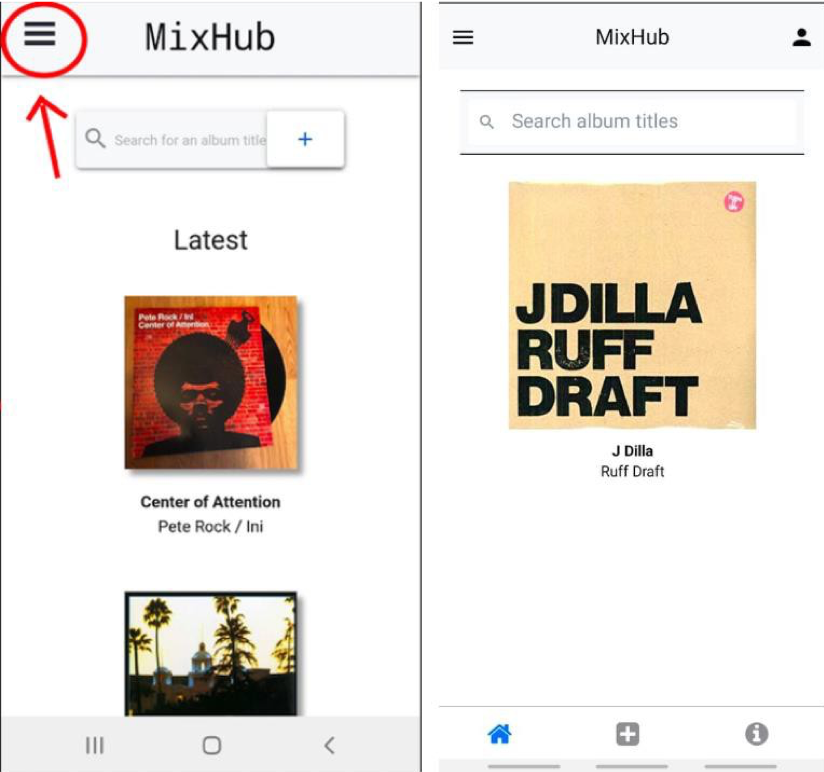

# MixHub Native

- This project was bootstrapped with Create React App.

 

- To run the react-native version of MixHub,

1. Enter the folder: cd mixhub-native

- Then run the following commands:

2. npm install (in the root directory & client directory)

3. react-native run-android - This runs the mobile app server . Ensure that a physical Android device is connected to the computer.

