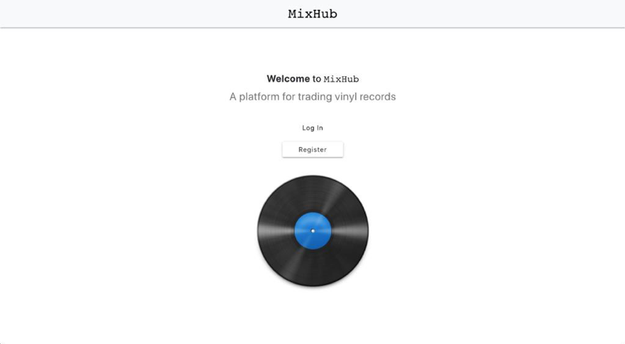

# MixHub

This project is a MERN stack application. It is a project which was carried out as a 4th & final year project for the Research Project module in the Creative Computing course at IADT Dun Laoighre. This app is a progressive web app & also available as a native mobile app. This folder contains the complete files of the MixHub application.

The goal for this application was to provide an online marketplace web application "MixHub" which allows users to trade vinyl records through a personalised experience.

The application will allow users to register an account & login. Users will also be able to view all records from the database, create new records, edit & delete their own listed records, search for a particular record & also add images for their created records. The app includes a Discovery section which uses the Last FM api allowing users to discover new music artists similar to artists which they currently know. Lastly, users can also view the top 10 record stores in Dublin on the 'Record Hub' page which uses the Google Maps api.

# Demos

- Video Demo: https://youtu.be/Q7h-j3_PvhU

- Showcase: https://onshow.iadt.ie/student/chris-keaveney/

- Online version of the PWA hosted on Heroku (Update 2023 no longer available): ⚛️  https://mixhub-mern.herokuapp.com/ ⚛️

# Technologies

- MERN (Mongo DB, Express.js, React.js, Node.js)
- Redux (for global state management)
- React Native (for native mobile version)

Styling:
- Material CSS
- React Bootstrap
- React Native Vector Icons
- React Native Material UI

# Native App

- To run the react-native version of MixHub,

1. Enter the folder: cd mixhub-native

- Then run the following commands:

2. npm install (in the root directory & client directory)

3. react-native run-android - This runs the mobile app server . Ensure that a physical Android device is connected to the computer.

# Extras

- This project was bootstrapped with Create React App.

